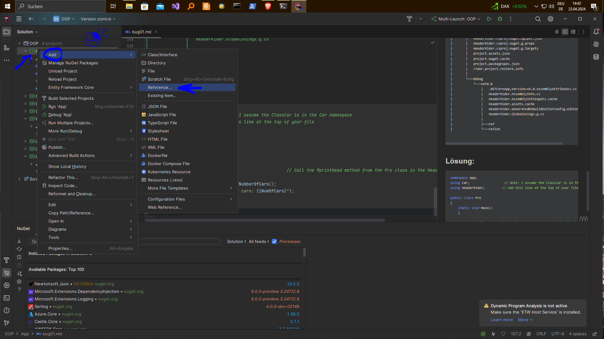

# bug

````csharp
Cannot resolve symbol 'MprintHead'
    Parameter 'args' is never used
````

````csharp
namespace App;
using Car;                  // Note: I assume the ClassCar is in the Car namespace

public class Pro
{
    static void Main(string[] args)
    {
        
        MprintHead();
        
        
        
        
        
        int iNumOfCars = ClassCar.GetNumberOfCars();   
        Console.WriteLine($"Number of cars: {iNumOfCars}");
        
        
    }
}
````


````powershell
PS C:\working-directory\c#NET\c#Rider\OOP> tree /F
Auflistung der Ordnerpfade
Volumeseriennummer : 96F9-B5D8
C:.
│   OOP.sln
│
├───.idea
│   └───.idea.OOP
│       └───.idea
│           │   .gitignore
│           │   encodings.xml
│           │   indexLayout.xml
│           │   projectSettingsUpdater.xml
│           │   workspace.xml
│           │
│           └───inspectionProfiles
│                   Project_Default.xml
│
├───.vscode
│       markdown-style.css
│       settings.json
│
├───App
│   │   App.csproj
│   │   bug01.md
│   │   doc.md
│   │   Pro.cs
│   │
│   ├───bin
│   │   └───Debug
│   │       └───net8.0
│   │               App.deps.json
│   │               App.dll
│   │               App.exe
│   │               App.pdb
│   │               App.runtimeconfig.json
│   │               Car.deps.json
│   │               Car.dll
│   │               Car.exe
│   │               Car.pdb
│   │               Car.runtimeconfig.json
│   │
│   └───obj
│       │   App.csproj.nuget.dgspec.json
│       │   App.csproj.nuget.g.props
│       │   App.csproj.nuget.g.targets
│       │   project.assets.json
│       │   project.nuget.cache
│       │   project.packagespec.json
│       │   rider.project.model.nuget.info
│       │   rider.project.restore.info
│       │
│       └───Debug
│           └───net8.0
│               │   .NETCoreApp,Version=v8.0.AssemblyAttributes.cs
│               │   App.AssemblyInfo.cs
│               │   App.AssemblyInfoInputs.cache
│               │   App.assets.cache
│               │   App.csproj.AssemblyReference.cache
│               │   App.csproj.CoreCompileInputs.cache
│               │   App.csproj.FileListAbsolute.txt
│               │   App.csproj.Up2Date
│               │   App.dll
│               │   App.GeneratedMSBuildEditorConfig.editorconfig
│               │   App.genruntimeconfig.cache
│               │   App.GlobalUsings.g.cs
│               │   App.pdb
│               │   apphost.exe
│               │
│               ├───ref
│               │       App.dll
│               │
│               └───refint
│                       App.dll
│
│
├───HeaderRider
│   │   HeaderRider.csproj
│   │   Pro.cs
│   │
│   ├───bin
│   │   └───Debug
│   │       └───net8.0
│   └───obj
│       │   HeaderRider.csproj.nuget.dgspec.json
│       │   HeaderRider.csproj.nuget.g.props
│       │   HeaderRider.csproj.nuget.g.targets
│       │   project.assets.json
│       │   project.nuget.cache
│       │   project.packagespec.json
│       │   rider.project.restore.info
│       │
│       └───Debug
│           └───net8.0
│               │   .NETCoreApp,Version=v8.0.AssemblyAttributes.cs
│               │   HeaderRider.AssemblyInfo.cs
│               │   HeaderRider.AssemblyInfoInputs.cache
│               │   HeaderRider.assets.cache
│               │   HeaderRider.GeneratedMSBuildEditorConfig.editorconfig
│               │   HeaderRider.GlobalUsings.g.cs
│               │
│               ├───ref
│               └───refint

````

## Lösung:

````csharp
        namespace App;
        using Car;                  // Note: I assume the ClassCar is in the Car namespace
        using HeaderRider;         // Add this line at the top of your file
        
        public class Pro
        {
            static void Main()
            {
                
                HeaderRider.Pro.MprintHead();                   // Call the MprintHead method from the Pro class in the HeaderRider namespace
                
                int iNumOfCars = ClassCar.GetNumberOfCars();   
                Console.WriteLine($"Number of cars: {iNumOfCars}");
                
            }
        }
````


